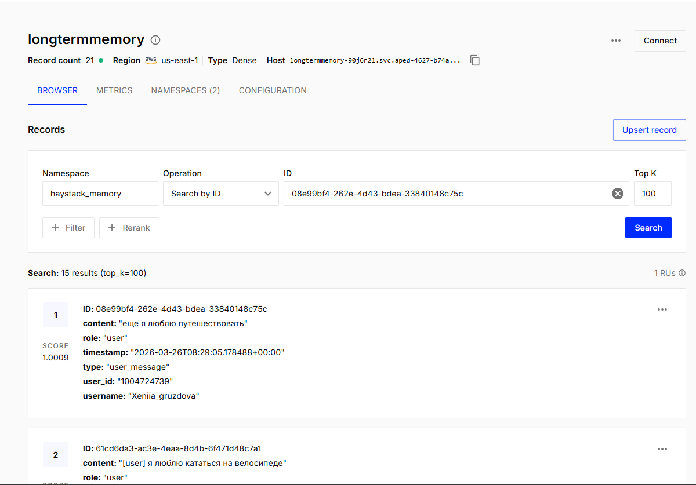
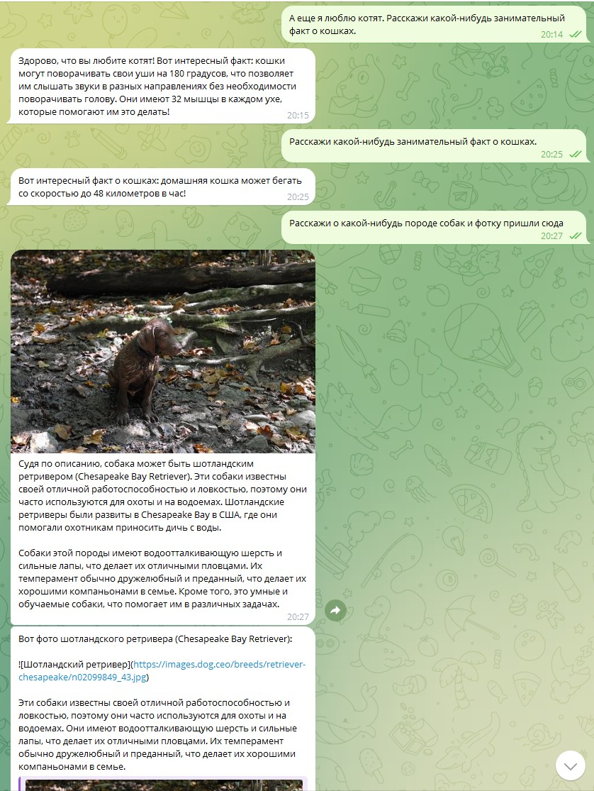
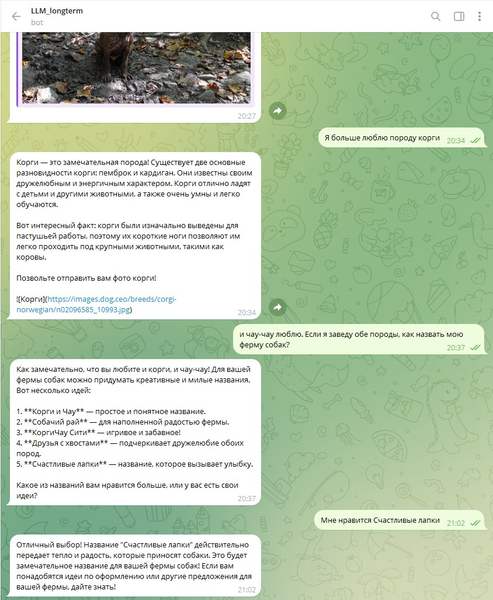
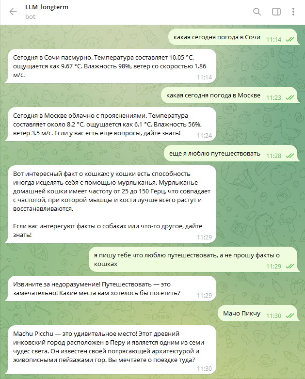
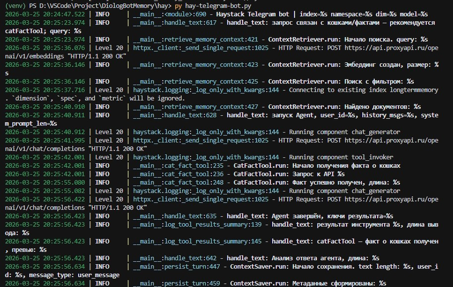
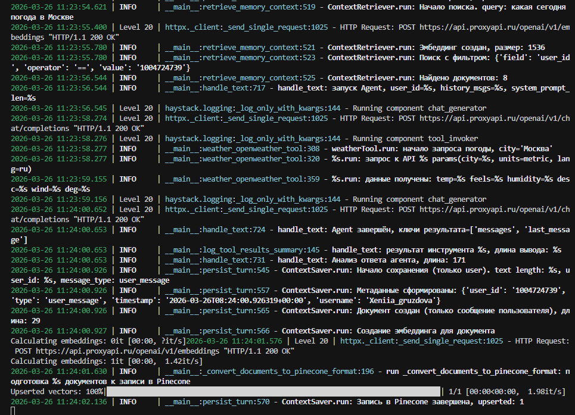

# DiologBotMemory

## Краткое описание

**DiologBotMemory** — набор Telegram-ботов на Python с **долговременной семантической памятью** в [Pinecone](https://www.pinecone.io/): бот запоминает, что пишет пользователь, и при следующих сообщениях подмешивает релевантный контекст в ответы LLM. Проект нужен для экспериментов с RAG-памятью, дедупликацией по косинусному сходству и, в расширенной версии, для **агента Haystack** с инструментами (факты о животных, анализ фото собаки через vision, погода по городу).

В репозитории два независимых сценария:

| Файл | Назначение |
|------|------------|
| `bot.py` | Классический диалог: OpenAI + `PineconeManager` (прямой Pinecone SDK), дедупликация при записи |
| `hay/hay-telegram-bot.py` | Агент **Haystack** + интеграция **pinecone-haystack**, инструменты, loguru, в Pinecone пишутся **только сообщения пользователя** |

## Использованные технологии

| Категория | Инструменты и сервисы |
|-----------|------------------------|
| Язык | Python 3.10+ |
| Telegram | [pyTelegramBotAPI](https://github.com/eternnoir/pyTelegramBotAPI) |
| LLM / vision | OpenAI-совместимый API (`gpt-4o-mini` и др.), переменная `OPENAI_BASE_URL` для прокси |
| Эмбеддинги | OpenAI `text-embedding-3-small` (размерность задаётся `PINECONE_DIMENSION`, по умолчанию 1536) |
| Векторная БД | [Pinecone](https://www.pinecone.io/) |
| Оркестрация (Haystack-бот) | [Haystack](https://haystack.deepset.ai/) (`haystack-ai`), [pinecone-haystack](https://haystack.deepset.ai/integrations/pinecone-document-store) |
| Логирование (Haystack-бот) | [loguru](https://github.com/Delgan/loguru) |
| HTTP к инструментам | `requests` (catfact.ninja, dog.ceo, kinduff и др.) |
| Конфигурация | `python-dotenv` (файл `.env`) |

## Реализованный функционал

### Общее

- Диалог в Telegram с ответами от языковой модели.
- **Изоляция пользователей** по `user_id` в метаданных Pinecone.
- Команды **`/start`**, **`/clear`**, **`/forget`** (см. ниже).

### `bot.py` (прямой Pinecone)

- Краткосрочная память: последние сообщения в буфере.
- Долговременная память: запись текста пользователя в Pinecone через `PineconeManager`.
- **Дедупликация** перед upsert: порог косинусного сходства (`COSINE_SIMILARITY_THRESHOLD` и др. в `pinecone_manager.py`).
- Логирование операций записи.

### `hay/hay-telegram-bot.py` (Haystack Agent)

- **Agent** с инструментами: `catFactTool`, `dogImageTool`, `dogFactTool`, `docImageAnalyzerTool` (случайное фото собаки → vision → в Telegram **фото + подпись**), `weatherTool` (текущая погода по городу через OpenWeather).
- Долговременная память: **PineconeDocumentStore** + **PineconeEmbeddingRetriever**, метрика cosine; в индекс сохраняется **только текст сообщений пользователя** (ответы ассистента в Pinecone не пишутся).
- Краткосрочная память: `deque` с `ChatMessage`.
- Цветные логи (loguru), подробные сообщения для цепочки «контекст → инструменты → сохранение».

## Инструкция по запуску

**1. Клонировать репозиторий и активировать виртуальное окружение**

```bash
python -m venv venv
venv\Scripts\activate
# Linux / macOS: source venv/bin/activate
```

**2. Установить зависимости**

```bash
pip install -r requirements.txt
```

**3. Создать файл `.env` в корне проекта**

Общие переменные:

```env
PINECONE_API_KEY=ваш_ключ
PINECONE_INDEX_NAME=название_индекса
OPENAI_API_KEY=ваш_ключ
OPENAI_BASE_URL=https://api.openai.com/v1
TELEGRAM_BOT_TOKEN=токен_от_BotFather
CHAT_MODEL=gpt-4o-mini
```

Для **Haystack-бота** дополнительно (при необходимости):

```env
EMBEDDING_MODEL=text-embedding-3-small
PINECONE_DIMENSION=1536
HAYSTACK_PINECONE_NAMESPACE=haystack_memory
OPENWEATHER_API_KEY=ваш_ключ_openweather
OPENWEATHER_API_BASE_URL=https://api.openweathermap.org/data/2.5
```

Размерность индекса Pinecone должна совпадать с размерностью эмбеддингов.

**4. Запуск**

Классический бот:

```bash
python bot.py
```

Бот с Haystack и агентом:

```bash
python hay/hay-telegram-bot.py
```

**5. (Опционально) Проверка Pinecone из `pinecone_manager`**

```bash
python pinecone_manager.py
```

## Доступы

| Ресурс | Как получить доступ |
|--------|----------------------|
| Исходный код | Локальный клон репозитория; путь к проекту на вашей машине |
| Telegram-бот | Создайте бота через [@BotFather](https://t.me/BotFather), подставьте `TELEGRAM_BOT_TOKEN` в `.env`. Ссылка на чат: `https://t.me/<username_вашего_бота>` (подставьте имя после создания) |
| Pinecone | [Pinecone Console](https://app.pinecone.io/) — индексы, namespace, ключ API |
| OpenAI / прокси | Как настроено в `OPENAI_BASE_URL` (например совместимый с OpenAI прокси) |

> В репозиторий не коммитьте `.env` с реальными ключами.

## Команды бота и внешние API

### Команды Telegram (оба бота)

| Команда | Действие |
|---------|----------|
| `/start` | Приветствие и краткая справка |
| `/clear` | Очистить краткосрочный буфер диалога в памяти процесса |
| `/forget` | Удалить долговременную память пользователя в Pinecone (в Haystack-боте — записи в namespace `HAYSTACK_PINECONE_NAMESPACE`) |

### REST API приложения

Отдельного HTTP-сервера в проекте нет: взаимодействие только через Telegram.

### Внешние API, вызываемые инструментами Haystack-бота

| Инструмент | URL / сервис | Назначение |
|------------|----------------|------------|
| `catFactTool` | `https://catfact.ninja/fact` | Случайный факт о кошках |
| `dogImageTool` | `https://dog.ceo/api/breeds/image/random` | URL случайного изображения собаки |
| `dogFactTool` | `https://dog-api.kinduff.com/api/facts` | Случайный факт о собаках |
| `docImageAnalyzerTool` | Dog CEO + OpenAI Chat Completions (vision) | Случайное фото собаки и описание породы |
| `weatherTool` | [OpenWeather Current Weather](https://openweathermap.org/current) | Текущая погода по городу (нужен `OPENWEATHER_API_KEY`) |

## Статус проекта

**В разработке.** Базовый сценарий диалога с памятью и расширенный Haystack-бот реализованы и могут дорабатываться.

Возможные направления:

- унификация или выбор одного «основного» entrypoint;
- доработка промптов и инструментов;
- тесты и CI;
- отдельная документация по миграции данных между namespace Pinecone.

## Скриншоты ключевых экранов

### Приветствие бота (/start)


### Создание индекса в Pinecone


### Диалог с ботом


### Диалог с ботом (пример 2)


### Запрос погоды


### Логирование Факт о кошках


### Логирование тулз о собаке


### Логирование тулз о погоде
